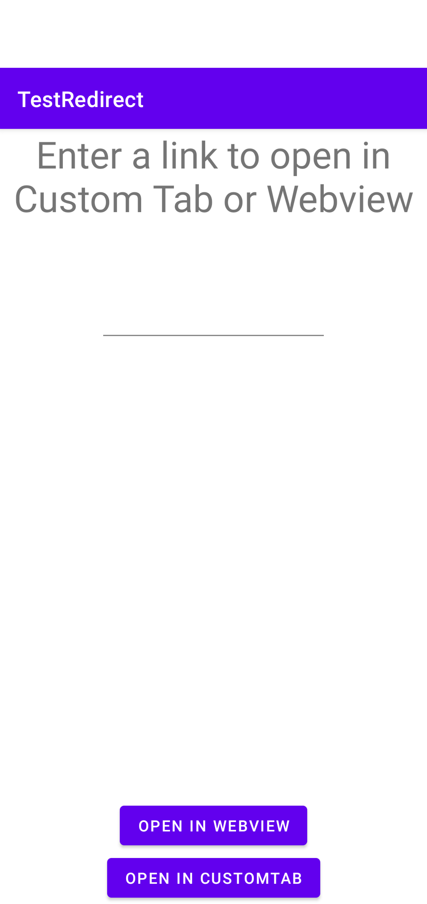
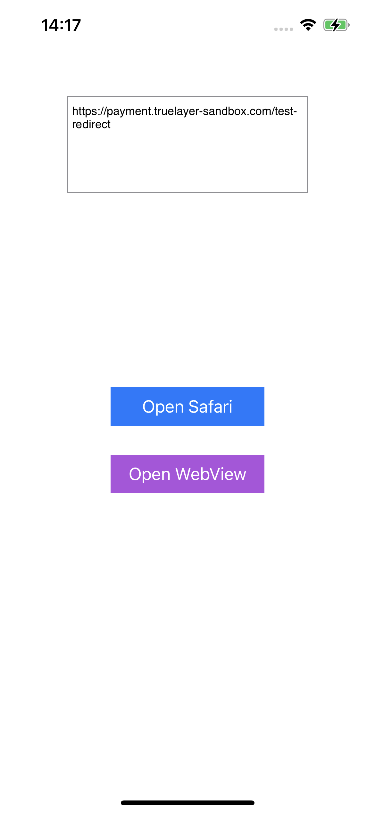
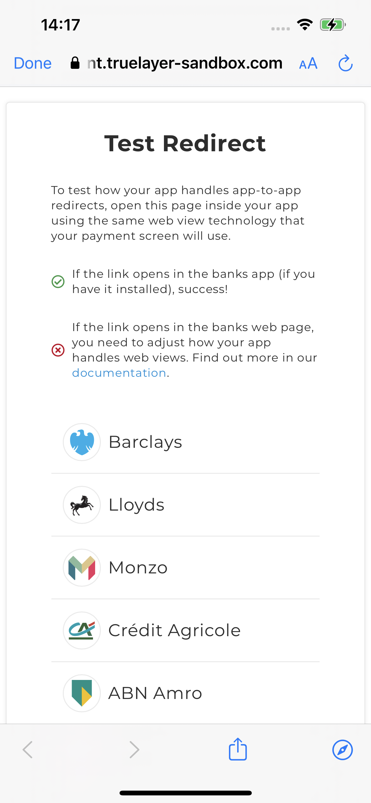

# Mobile Webview examples
[](https://truelayer.mit-license.org/)

Reference applications showcasing best practices when dealing with Webviews to ensure that redirection to native bank applications work as expected.

## Android




<br/>


Requirements:
- Android: Requires [Android Studio Chipmunk+](https://developer.android.com/studio)

<br/>
<br/>

### Using Android WebView
When using an Android WebView the following steps will help ensure redirects work correctly.

- Enable DOM storage and Javascript 
``` kotlin
val webView = findViewById<WebView>(R.id.web_view)

val settings: WebSettings = webView.settings
settings.domStorageEnabled = true
settings.javaScriptEnabled = true
```

- Override the `shouldOverrideUrlLoading` method to open bank URL's via an intent
``` kotlin
override fun shouldOverrideUrlLoading(
    view: WebView?,
    request: WebResourceRequest?
): Boolean {
    val uri = request?.url
    if (uri != null && uri.host?.contains("truelayer") == false) {
        openUri(uri)
        return true
    }
    return false
}
```

- Attempt to open the bank's URL in non-browser apps

When opening a URL that should redirect the user to a bank app you canc create an intent that will launch directly in any non-browser app that can handle the URL. If this fails and an exception is thrown that means the bank's app is not installed and you will have to open the URL in a browser.
``` kotlin
private fun openUri(uri: Uri) {
    try {
        val intent = Intent(ACTION_VIEW, uri).apply {
            // The URL should either launch directly in a non-browser app (if it's
            // the default), or in the disambiguation dialog.
            addCategory(CATEGORY_BROWSABLE)
            flags = if (Build.VERSION.SDK_INT >= Build.VERSION_CODES.R) {
                FLAG_ACTIVITY_NEW_TASK or FLAG_ACTIVITY_REQUIRE_NON_BROWSER
            } else {
                FLAG_ACTIVITY_NEW_TASK
            }
        }
        startActivity(intent)
    } catch (e: ActivityNotFoundException) {
        // Only browser apps are available, or a browser is the default.
        // So you will have to open the website
        val intent = Intent(ACTION_VIEW, uri)
        startActivity(intent)
    }
}
```

### Using Custom Tabs
Custom Tabs by default will use the user's preferred browser app but not every browser supports app links. To negate this you can specify that Google Chrome is used for your custom tabs and fallback to the default browser if it isn't available.

```kotlin
private fun loadCustomTab(url: String) {
    try {
        // Attempts to start custom tab with Google Chrome
        val builder = CustomTabsIntent.Builder()
        val customTabsIntent = builder.build()
        customTabsIntent.intent.setPackage("com.android.chrome")
        customTabsIntent.launchUrl(this, Uri.parse(url))
    } catch (e: Exception) {
        // If Google Chrome isn't available then uses the default browser
        val builder = CustomTabsIntent.Builder()
        val customTabsIntent = builder.build()
        customTabsIntent.launchUrl(this, Uri.parse(url))
    }
}
```

## iOS





<br/>

Requirements:
- iOS: Requires [XCode Version 13.2+](https://developer.apple.com/xcode/)

<br/>
<br/>

## Contributing
Contributions are always welcome!

## License

[MIT](LICENSE)