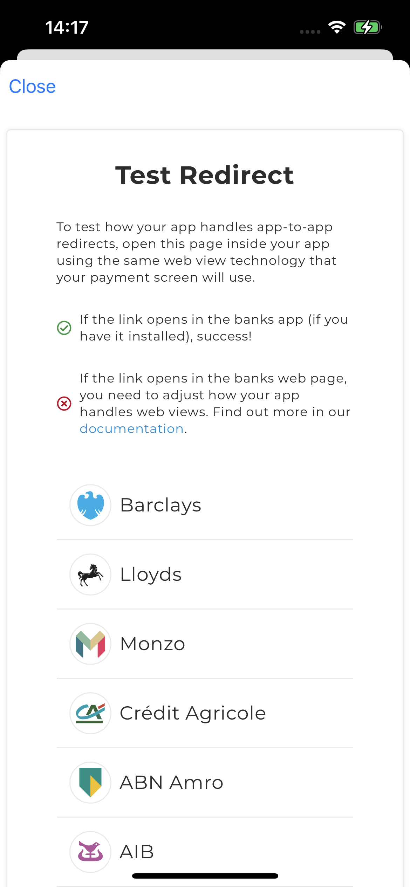
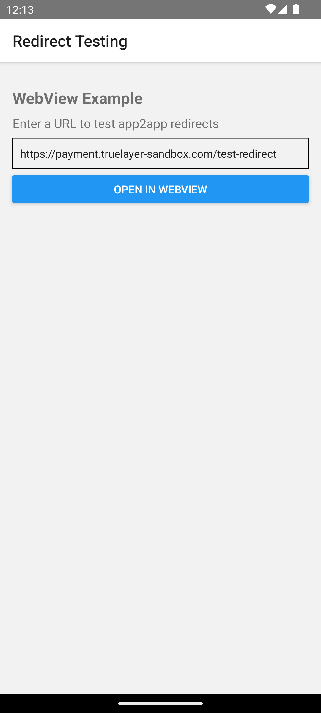

# Mobile Webview examples
[](https://truelayer.mit-license.org/)

Reference applications showcasing best practices when dealing with Webviews to ensure that redirection to native bank applications work as expected.

## Android


<br/>


Requirements:
- Android: Requires [Android Studio Chipmunk+](https://developer.android.com/studio)

<br/>
<br/>


## iOS

The android example shows how to present the `HPP` using SFSafariViewController (recommended), or a webview.




<br/>

Requirements:
- iOS: Requires [XCode Version 13.2+](https://developer.apple.com/xcode/)

<br/>
<br/>

## React Native


<br/>

Requirements:
- Node 16+

### Suggestions
When using a React Native WebView the success of app2app depends on the user's default browser. The WebView by default will open app links correctly but any link that opens a new tab will be sent to the user's browser. To prevent this you can disable multiple windows.

``` html
<WebView
      source={{ uri: url }}
      onNavigationStateChange={this.handleWebViewNavigationStateChange}
      setSupportMultipleWindows={false}
    />
```

After disabling multiple windows you'll need to handle all app links manually. This can be done by adding a `onNavigationStateChange` listener and opening any non-hosted-payments-page url with the `Linking` class.
``` javascript
// attempt to redirect to an installed app
     handleWebViewNavigationStateChange = (newNavState) => {
        const { url } = newNavState;

        if (!url) return;

        // attempt to redirect to an installed app
        if (!url.includes('payment.truelayer-sandbox.com') && !url.includes('payment.truelayer.com')) {
        Linking.openURL(url).catch(err =>
            console.error('An error occurred', err)
        )    
        }
    };
```

<br/>
<br/>

## Contributing
Contributions are always welcome!

## License

[MIT](LICENSE)
